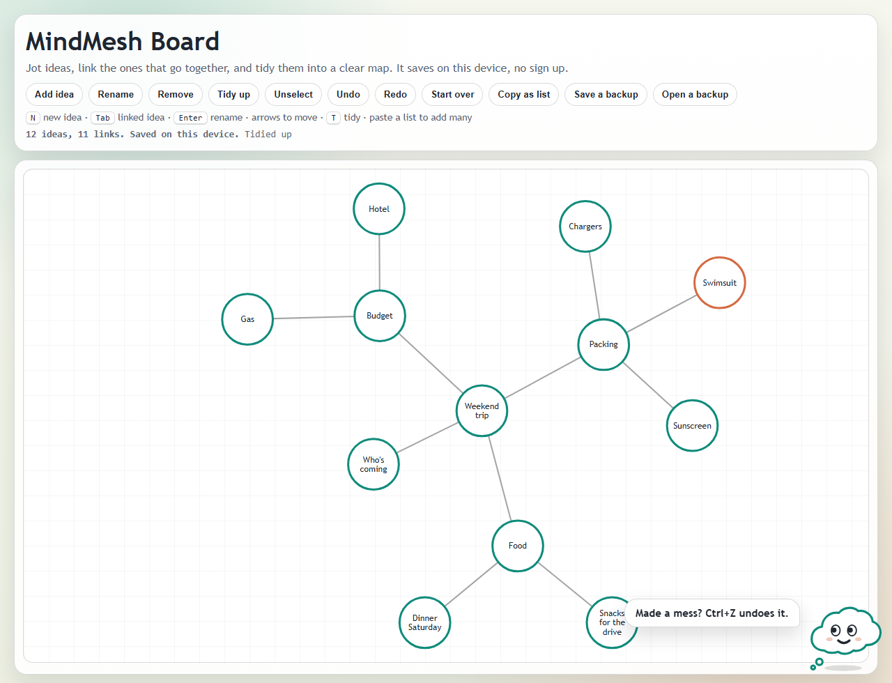

# MindMesh Board

Jot ideas, link the ones that go together, and tidy them into a clear map. It runs in the browser, saves on your device, and needs no account.

Live: https://johanthegoat.xyz/work/mindmesh/



## What you can do

- **Add ideas fast from the keyboard.** Pick an idea and press `Tab` to add one already linked to it, with the name box open. Press `Tab` again to keep going. `Enter` renames, arrow keys hop between ideas, `N` adds a loose idea.
- **Tidy up.** Press `T` (or the button) and the board rearranges itself so linked ideas sit together and nothing overlaps.
- **Paste a list, get a map.** Copy any bulleted or indented list from your notes and press `Ctrl+V` on the board.
- **Copy as list.** Turn the map back into bullet points for a doc, an email or a notes app.
- **Use two tabs.** Open the board twice and changes show up in both, including removed ideas.
- **Undo anything** with `Ctrl+Z`, and save or open a backup file.
- **Pip**, the thought bubble in the corner, gives tips that fit what you're doing. Tap Pip for one, or tuck Pip away.

## How it's built

No framework and no backend: ES modules, an SVG board, and `node --test` for the logic.

| File | What it does |
| --- | --- |
| `src/boardState.js` | Ideas, links, merge between tabs, undo restore |
| `src/layout.js` | Tidy up (force-directed layout) |
| `src/keyboard.js` | Where a new linked idea goes, which idea an arrow key picks |
| `src/outline.js` | Map to bulleted list and back |
| `src/pip.js` | Pip the mascot |
| `src/history.js`, `src/persistence.js`, `src/syncBus.js` | Undo stack, local save, tab-to-tab messages |

### The research behind each part

- **Deletes that stick across tabs.** Tabs share full snapshots over `BroadcastChannel`, and merging used to only add or overwrite, so a removed idea came back the moment another tab sent an older copy. Removing an idea now leaves a timestamped tombstone: the last-writer-wins element set from Shapiro, Preguiça, Baquero and Zawirski, *A comprehensive study of Convergent and Commutative Replicated Data Types* (INRIA RR-7506, 2011). An edit made after the removal still wins, and undo restamps what it restores so the other tab gets it back too.
- **Tidy up.** Fruchterman and Reingold, *Graph Drawing by Force-directed Placement* (Software: Practice and Experience 21(11), 1991). Ideas push apart with k²/d, links pull with d²/k, and a cooling step size lets the board settle. Two changes from the textbook version came from real boards: k is capped at 150 px so a small map doesn't fling ideas into the corners, and pairs further apart than 2k don't push (the paper's own grid variant), so a lone idea isn't shoved off by everything else. A last pass separates any circles that still touch. The run is seeded, so the same board always tidies the same way.
- **Keyboard first.** Card, Moran and Newell's keystroke-level model (*CACM* 23(7), 1980) puts a key press near 0.2 s and pointing with a mouse near 1.1 s. Adding a linked idea used to take a button click, a drag, two clicks to link and a browser prompt. Now it is one key.
- **Lists in and out.** Nesting follows the CommonMark list item rules (https://spec.commonmark.org/0.31.2/#list-items), with a tab counted as four spaces, so lists from notes apps keep their shape. Dashes, stars, numbers, checkboxes and plain indented lines all work, and a pasted list copies back out in the same order.
- **Pip.** Lester et al., *The Persona Effect: Affective Impact of Animated Pedagogical Agents* (CHI 1997), found people rated a learning task more helpful and engaging with an animated guide present. Pip follows the pattern: eyes track the pointer and the picked idea, the face follows the board's state, tips change with the stage you're at, and every line goes through a live region for screen readers. Pip holds still when the system asks for reduced motion.

## Run it

```bash
npm run dev
```

Then open http://localhost:8091.

## Test

```bash
npm test
```

35 tests cover merging and tombstones, undo restore, the layout (no overlaps, linked ideas closer than unlinked ones, no crossings on a tree, stays on the board), keyboard placement, label wrapping, list round trips, and Pip's tips staying short and free of jargon.

## License

MIT
